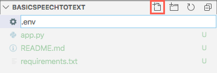

# Project Setup Instructions

You will need Python installed to run these samples. Ideally you will need a developer text editor like Visual Studio Code to create some files and view the code. To get this set up, follow the instructions in the [Set up your Python beginner development environment with Visual Studio Code](https://docs.microsoft.com/learn/modules/python-install-vscode/?WT.mc_id=speechtotextsamples-github-jabenn) module on Microsoft Learn.

## Create an environment variables file

The code needs to know your Speech to Text service region and key. These values can be added to a file called `.env` and loaded by the code as environment variables at run time.

1. Open the folder for the sample you want to run in Visual Studio Code

1. Select the **New File** button in the explorer and create a new file called `.env`

    

1. Add the following to this file:

    ```sh
    KEY=<key>
    REGION=<region>
    ```

    Set `<key>` to the key you copied when setting up the Speech to Text resource.

    Set `<region>` to the location you used when setting up the Speech to Text resource.

## Configure a virtual environment

Python comes in various versions, and Python apps can use external code in packages installed via a tool called `pip`. This can lead to problems if different apps need different package versions, or different Python versions. To make it easier to avoid issues with package or Python versions, it is best practice to use *virtual environments*, self-contained folder trees that contain a Python installation for a particular version of Python, plus a number of additional packages.

1. When the new Visual Studio Code window is opened, the terminal should be opened by default. If not, open a new terminal by selecting *Terminal -> New Terminal*.

1. Create a new virtual environment called `.venv` using Python 3 by running the following command in the terminal

   ```sh
   python3 -m venv .venv
   ```

1. A dialog will pop up asking if you want to activate this virtual environment. Select **Yes**.

   

1. The existing terminal will not have the virtual environment activated. Close it by selecting the trash can button

   

1. Create a new terminal by selecting *Terminal -> New Terminal*. The terminal will load the virtual environment

## Restore the pip packages

This code relies on a number of Python packages:

| Package | Description |
| ------- | ----------- |
| [azure-cognitiveservices-speech](https://pypi.org/project/azure-cognitiveservices-speech/) | The Python SDK for the Azure Speech cognitive service |
| [python-dotenv](https://pypi.org/project/python-dotenv/) | A package that can load environment variables from `.env` files |

These packages can be restored from the terminal.

1. From the terminal, restore the packages with the following command:

    ```sh
    pip install -r requirements.txt
    ```

The packages will be installed into the virtual environment.
